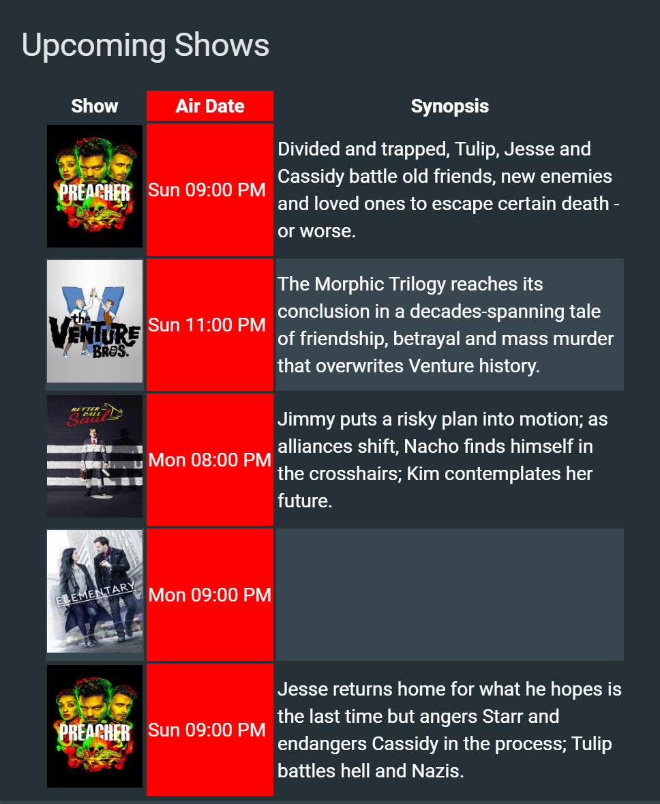

# List Card

This card for [Lovelace](https://www.home-assistant.io/lovelace) on [Home Assistant](https://www.home-assistant.io/) that gives you a table generated with data from the [feedparser custom component](https://github.com/custom-components/sensor.feedparser) or any other sensor that provides data as a list of attributes.

[![GitHub Release][releases-shield]][releases]
[![License][license-shield]](LICENSE.md)

![Project Maintenance][maintenance-shield]
[![GitHub Activity][commits-shield]][commits]

[![Discord][discord-shield]][discord]
[![Community Forum][forum-shield]][forum]

[![Twitter][twitter]][twitter]
[![Github][github]][github]

## Support
Hey dude! Help me out for a couple of :beers: or a :coffee:!

[](https://www.buymeacoffee.com/zJtVxUAgH)

Great resource for further filtering your feeds is [siftrss](https://siftrss.com/)



From left to right: [feedparser](https://github.com/custom-components/sensor.feedparser) | [aftership](https://github.com/custom-components/sensor.aftership) | [untappd](https://github.com/custom-components/sensor.untapped)

## Options

| Name | Type | Requirement | Description
| ---- | ---- | ------- | -----------
| type | string | **Required** | `custom:list-card`
| entity | string | **Required** | The entity_id of the entity you want to show.
| feed_attribute | string | **Optional** | Attribute containing the feed
| title | string | **Optional** | Add a custom title to the card.
| row_limit | number | **Optional** | Limit the number of rows to display.
| columns | object | **Optional** | List of columns to display.

## Column object

| Name | Type | Requirement | Description
| ---- | ---- | ------- | -----------
| title | string | **Required** | Column header to display.
| field | string | **Required** | key value of the entity that you wish to display.
| add_link | string | **Optional** | key value of entity that has the link property to use.
| type | string | **Optional** | options are `image`. Default is `None`. **Only set this for images, otherwise leave blank**
| style | object | **Optional** | CSS styles to apply to this column.
| regex | string | **Optional** | Regex string to apply to field.
| prefix | string | **Optional** | String to prefix to field.
| postfix | string | **Optional** | String to postfix to field.


## Installation

### Step 1

Save [list-card](https://raw.githubusercontent.com/custom-cards/list-card/master/list-card.js) to `<config directory>/www/list-card.js` on your Home Assistant instanse.

**Example:**

```bash
wget https://raw.githubusercontent.com/custom-cards/list-card/master/list-card.js
mv list-card.js /config/www/
```

### Step 2

Link `list-card` inside you `ui-lovelace.yaml`.

```yaml
resources:
  - url: /local/list-card.js?v=0
    type: js
```

### Step 3

Add a custom element in your `ui-lovelace.yaml`

```yaml
      - type: custom:list-card
        entity: sensor.engineering_feed
        title: Engineering Feed
        columns:
          - title: ''
            type: image
            add_link: link
            field: image
          - title: Title
            field: title
            style:
              - white-space: nowrap
          - title: Description
            field: description
```

[Troubleshooting](https://github.com/thomasloven/hass-config/wiki/Lovelace-Plugins)

[commits-shield]: https://img.shields.io/github/commit-activity/y/custom-cards/list-card.svg?style=for-the-badge
[commits]: https://github.com/custom-cards/list-card/commits/master
[discord]: https://discord.gg/Qa5fW2R
[discord-shield]: https://img.shields.io/discord/330944238910963714.svg?style=for-the-badge
[forum-shield]: https://img.shields.io/badge/community-forum-brightgreen.svg?style=for-the-badge
[forum]: https://community.home-assistant.io/t/custom-component-rss-feed-parser/64637
[license-shield]: https://img.shields.io/github/license/custom-cards/list-card.svg?style=for-the-badge
[maintenance-shield]: https://img.shields.io/badge/maintainer-Ian%20Richardson%20%40iantrich-blue.svg?style=for-the-badge
[releases-shield]: https://img.shields.io/github/release/custom-cards/list-card.svg?style=for-the-badge
[releases]: https://github.com/custom-cards/list-card/releases
[twitter]: https://img.shields.io/twitter/follow/iantrich.svg?style=social
[github]: https://img.shields.io/github/followers/iantrich.svg?style=social
